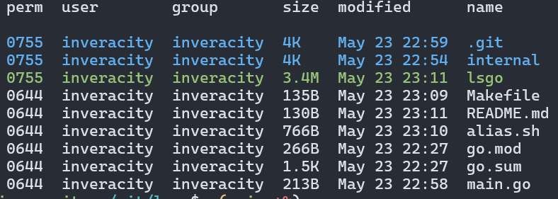

# lsgo

Artisanally hand-written old-fashioned code

Since Canonical decided to break the `ls --group-directories-first` command by vibe-coding coreutils in Rust (https://github.com/uutils/coreutils/issues/11997), I'm making my own in Golang.



## Run

```sh
go run main.go ~/
```

## Build and run

```sh
make build
./lsgo ~/
```

## Install

```sh
make install
```
